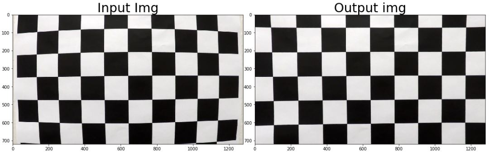
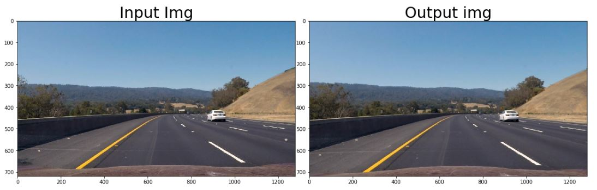
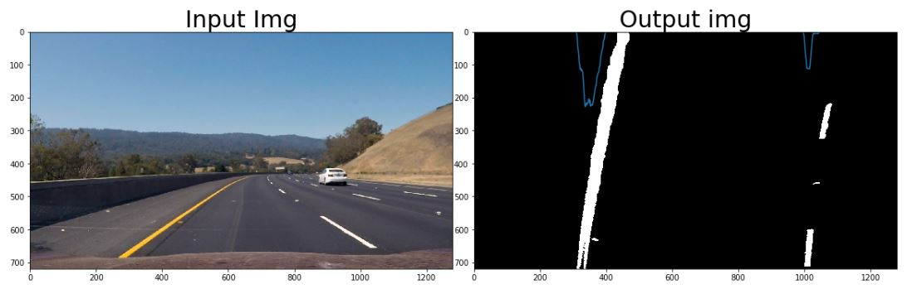
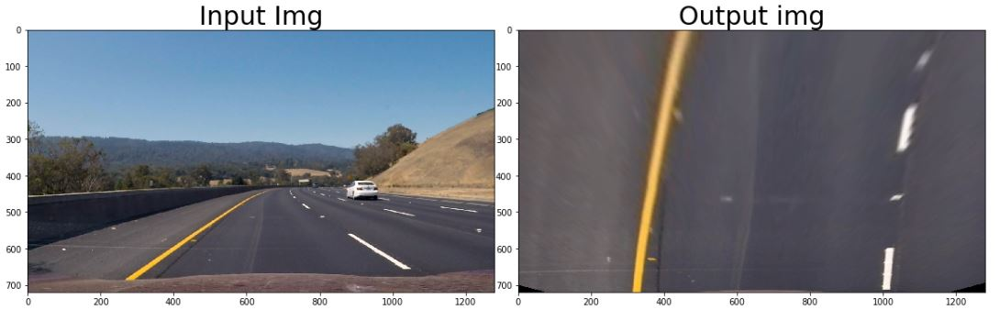
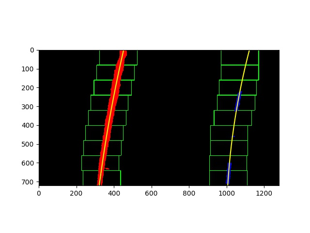
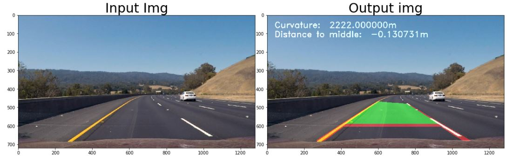

# Project: Advanced Lane Finding

Overview
---
In this project, your goal is to write a software pipeline to identify the lane boundaries in a video, but the main output or product we want you to create is a detailed writeup of the project.  Check out the [writeup template](https://github.com/udacity/CarND-Advanced-Lane-Lines/blob/master/writeup_template.md) for this project and use it as a starting point for creating your own writeup.  


The Project
---

The goals / steps of this project are the following:

* Compute the camera calibration matrix and distortion coefficients given a set of chessboard images.
* Apply a distortion correction to raw images.
* Use color transforms, gradients, etc., to create a thresholded binary image.
* Apply a perspective transform to rectify binary image ("birds-eye view").
* Detect lane pixels and fit to find the lane boundary.
* Determine the curvature of the lane and vehicle position with respect to center.
* Warp the detected lane boundaries back onto the original image.
* Output visual display of the lane boundaries and numerical estimation of lane curvature and vehicle position.

The images for camera calibration are stored in the folder called `camera_cal`.  The images in `test_images` are for testing your pipeline on single frames.

---

Writeup
---

**Advanced Lane Finding**

---

### Camera Calibration

#### 1. Briefly state how you computed the camera matrix and distortion coefficients. Provide an example of a distortion corrected calibration image.

The code for this step is contained in the cells 4-5 of the IPython notebook located in "1-Camera Calibration.ipynb". 

I start by preparing "object points", which will be the (x, y, z) coordinates of the chessboard corners in the world. Here I am assuming the chessboard is fixed on the (x, y) plane at z=0, such that the object points are the same for each calibration image.  Thus, `objp` is just a replicated array of coordinates, and `objpoints` will be appended with a copy of it every time I successfully detect all chessboard corners in a test image.  `imgpoints` will be appended with the (x, y) pixel position of each of the corners in the image plane with each successful chessboard detection.  

I then used the output `objpoints` and `imgpoints` to compute the camera calibration and distortion coefficients using the `cv2.calibrateCamera()` function.  I applied this distortion correction to the test image using the `cv2.undistort()` function and obtained this result: 



### Pipeline (single images)

#### 1. Provide an example of a distortion-corrected image.

To demonstrate this step, I will describe how I apply the distortion correction to one of the test images like this one:


#### 2. Describe how (and identify where in your code) you used color transforms, gradients or other methods to create a thresholded binary image.  Provide an example of a binary image result.

I used a combination of color and gradient thresholds to generate a binary image (thresholding steps at code cells 5-11 in "2-Transform Color and Gradients Threshold.ipynb").  Here's an example of my output for this step.



#### 3. Describe how (and identify where in your code) you performed a perspective transform and provide an example of a transformed image.

The code for my perspective transform includes a function called `birds_eye()`, which appears in lines 3 and 4 in "3-Perspective transform.ipynb".  The `warper()` function takes as inputs an image (`img`), as well as source (`src`) and destination (`dst`) points.  I chose the hardcode the source and destination points in the following manner:

```python
lanewidth=300
h=720
w=1280

# define src points through getting a plane in the image
src = np.float32([(575,464),
                  (707,464), 
                  (258,682), 
                  (1049,682)])

# Defining the destinations points through offset and w/h of the given image
dst = np.float32([(lanewidth,0),
                  (w-lanewidth,0),
                  (lanewidth,h),
                  (w-lanewidth,h)])
```

I verified that my perspective transform was working as expected by analysing the output of every test_images. Here you can see an example of the test3.jpg:



#### 4. Describe how (and identify where in your code) you identified lane-line pixels and fit their positions with a polynomial?

This is all done in the class Lane in the code cell 12 of my IPython notebook "4-Deliverables and final.ipynb".

There are a lot of steps involved, so please have a look at the code, but here is the basic idea:
Taking the histogram of the thresholded image, you can start search where the histogram has its peaks. 
With that in mind, a sliding window approach searchs for the next frame that has enough lane pixel in it.
All these windows combined together are containing the total lane.

For the blind search algorithm, the result looks like this:


Further, the above described approach is only used for the first 10 function calls. After that, the sliding window is too time/resource consuming and therefore dropped.

Based on the already found lane, all nonzero values are taking into account to calculate the new lane (again fit with the same algorithm). 

#### 5. Describe how (and identify where in your code) you calculated the radius of curvature of the lane and the position of the vehicle with respect to center.

The algorithm is implemented in the Lane class in code cell 13 of the IPython notebook in the function calculateCurvature().

It basically fits the left and right curve with the polyfit function of OpenCV. After that these are converted into radian degrees and weighted half-half. 

#### 6. Provide an example image of your result plotted back down onto the road such that the lane area is identified clearly.

This step is as well done in the Lane class with the function fill_lanes(). 

Here, some points of the calculated 2nd order fit are extracted and printed into the picture to fill the space between right and left lane.

Moreover, the curvature and distance are put into the picture.

Here is an example of my result on a test image:



---

### Pipeline (video)

#### 1. Provide a link to your final video output.  Your pipeline should perform reasonably well on the entire project video (wobbly lines are ok but no catastrophic failures that would cause the car to drive off the road!).

Here's a [link to my video result](./project_video_output.mp4)

---

### Discussion

#### 1. Briefly discuss any problems / issues you faced in your implementation of this project.  Where will your pipeline likely fail?  What could you do to make it more robust?

I tried to implement a kinda moving average algorithm that smooths the detected lanes, but polyfit returns different size arrays, which makes it harder, but it would still be possible. 

Moreover, I would like to test the algorithm on my own video, probably will do that. But I didn't found a appropriate holder.

Moreover, the algorithm can't perform very well on the challenge_video.mp4 video. 

It fails if the lane is not in good light or the color is not so bright anymore.